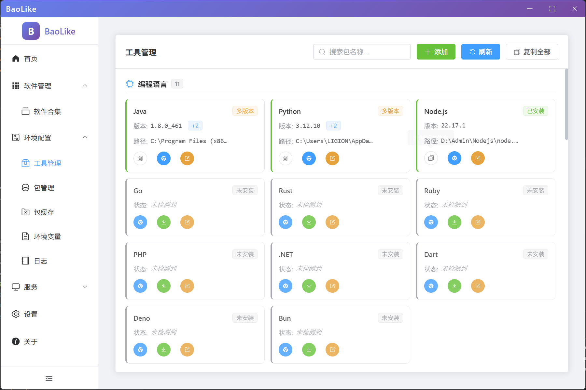
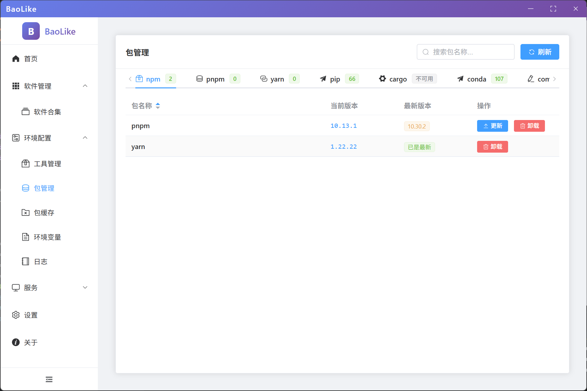
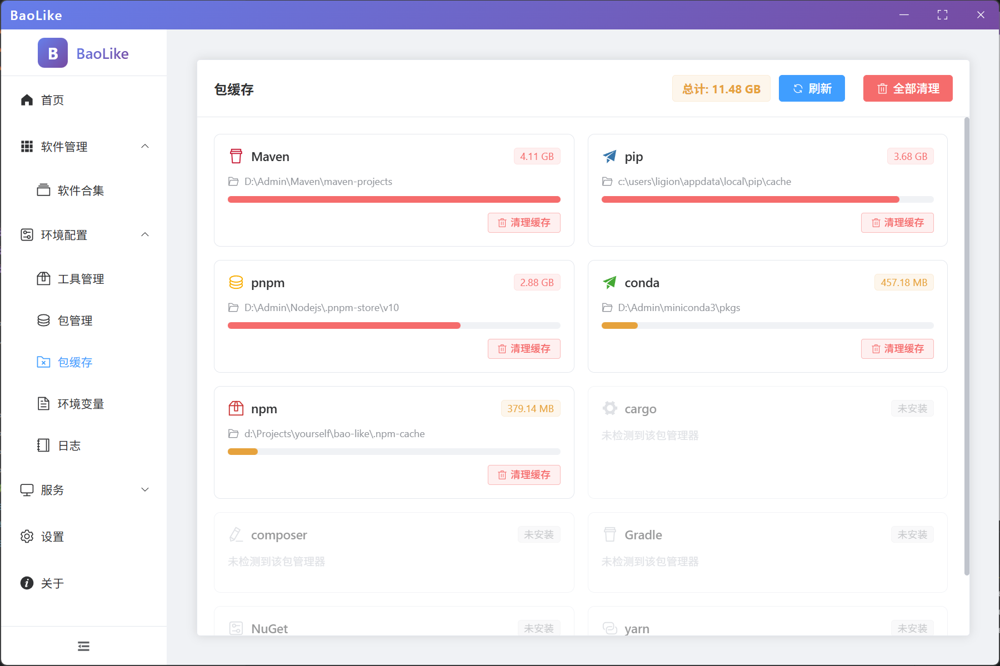

# BaoLike

一个基于 Electron + Vue3 的系统工具管理平台，提供软件包管理、环境配置、系统监控等功能。

## 🌟 特性

- **软件管理**: 统一管理本地软件包和依赖
- **环境配置**: 环境变量、日志查看、包缓存管理
- **系统监控**: 进程监控、端口监控
- **现代化界面**: 基于 Vue3 和 Electron 构建的桌面应用

## 🛠 技术栈

- **前端框架**: Vue 3 + TypeScript
- **桌面应用**: Electron
- **构建工具**: Vite
- **UI 组件**: 自定义组件库
- **状态管理**: Vue Composition API
- **路由管理**: Vue Router

## 📁 项目结构

```
bao-like/
├── electron/           # Electron 主进程代码
│   ├── modules/       # 核心功能模块
│   │   ├── logger.js         # 日志管理
│   │   ├── packageManager.js # 包管理器
│   │   ├── systemMonitor.js  # 系统监控
│   │   └── toolScanner.js    # 工具扫描
│   ├── main.js       # 主进程入口
│   ├── app.js        # 应用逻辑
│   └── preload.js    # 预加载脚本
├── src/              # Vue 前端代码
│   ├── components/   # Vue 组件
│   ├── views/        # 页面视图
│   ├── router/       # 路由配置
│   └── config/       # 配置文件
├── dist/             # 构建输出
└── release/          # 发布包
```

## 🚀 快速开始

### 环境要求

- Node.js >= 16.0.0
- npm >= 8.0.0

### 安装依赖

```bash
npm install
```

### 开发模式

```bash
npm run dev
```

### 构建应用

```bash
# 构建 Web 版本
npm run build

# 构建桌面应用
npm run build:electron
```

### 运行桌面应用

```bash
npm run electron:dev
```

## 📷 项目截图

### 环境配置模块

<div align="center">
  
  
  <br/>
  
</div>

## 📦 功能模块

### 软件管理
- 软件包收集与管理
- 依赖关系分析
- 版本控制

### 环境配置
- 系统环境变量管理
- 日志文件查看
- 包缓存清理
- 依赖包管理

### 系统监控
- 进程状态监控
- 端口使用情况
- 系统资源监控

## 🔧 配置说明

应用配置文件位于 `src/config/` 目录下，包含默认工具配置等。

## 🤝 贡献

欢迎提交 Issue 和 Pull Request 来帮助改进这个项目。

## 📄 许可证

MIT License

## 🙏 致谢

感谢以下开源项目：
- [Electron](https://www.electronjs.org/)
- [Vue.js](https://vuejs.org/)
- [Vite](https://vitejs.dev/)